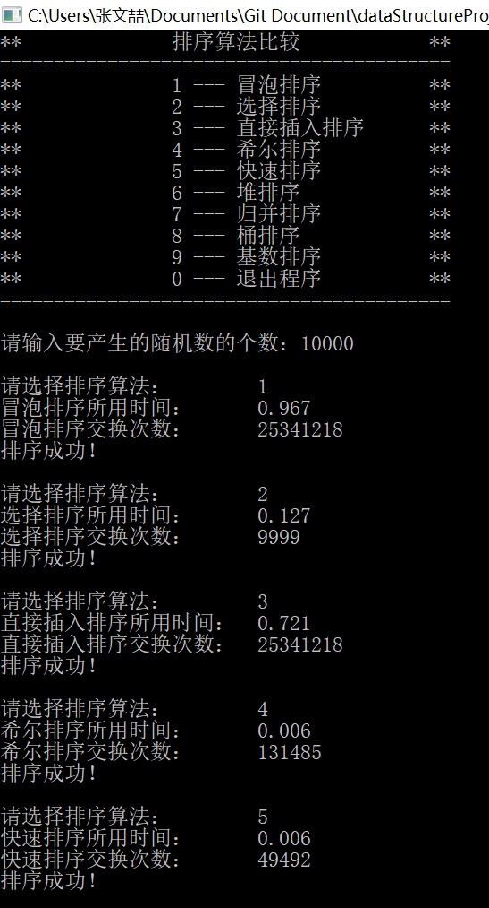
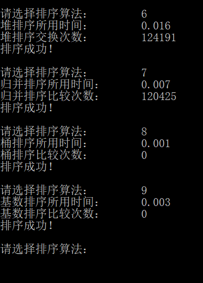
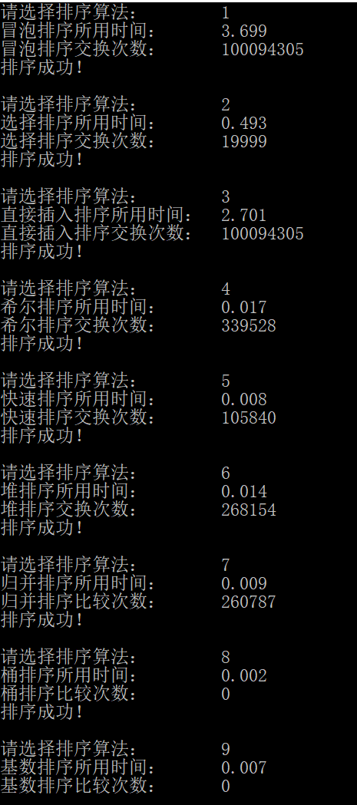
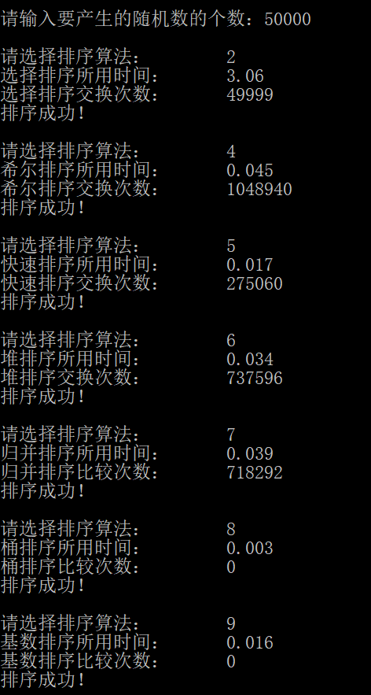
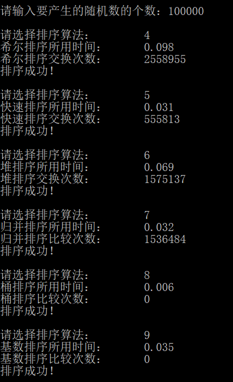
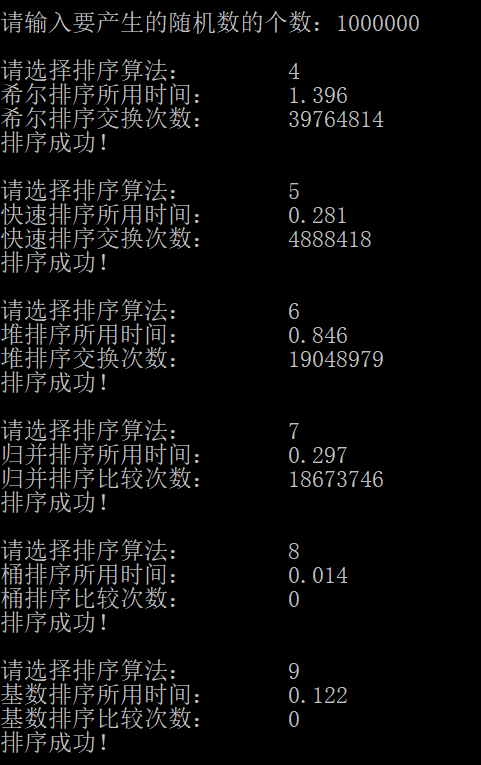
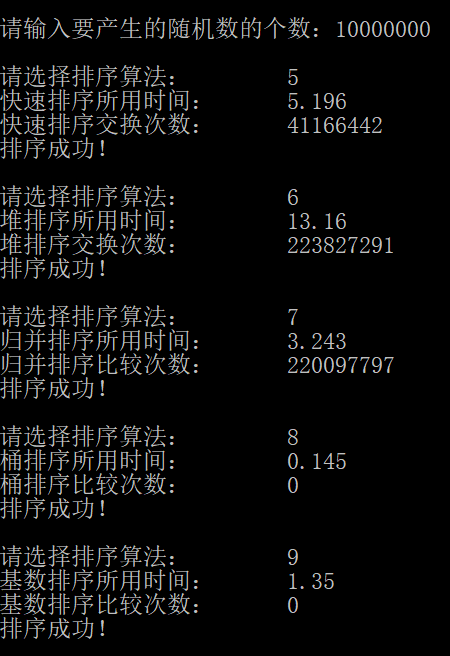

# 数据结构课程设计

#### 作者：张文喆

## 8 种排序算法的比较案例

### 0. 项目简介
随机函数产生10000个随机数，用快速排序，直接插入排序，冒泡排序，选择排序的排序方法排序，并统计每种排序所花费的排序时间和交换次数。其中，随机数的个数由用户定义，系统产生随机数。并且显示他们的比较次数。 

### 1. 项目运行效果

- 输入随机数个数，并选择排序类型  
在程序运行之初，用户首先会被要求输入随机数的个数。输入完毕后，会被要求选择排序的类型。  




经过实践发现，项目示例中的比较次数可能存在错误，但这并不影响我们比较各种排序算法的时间复杂度；而各种排序方案，除了桶排序和基数排序外，在空间上的差距并不大，所以我在后面会着重分析各种排序算法的时间复杂度。为此我将采用不同的随机数数量进行测试。

### 2. 时间测试  
在本项测试中，将不同的随机数数量设置为不同的等级，规定某一排序算法消耗时间超过1s，即告“淘汰”，无法进入下一等级的测试。

- 20000个随机数  
  
冒泡排序、直接插入排序被淘汰

- 50000个随机数  
  
选择排序被淘汰

- 100000个随机数  


- 1000000个随机数  
  
希尔排序被淘汰

- 10000000个随机数  
  
快速排序、堆排序、归并排序、基数排序被淘汰

### 3. 算法分析  
接下来我将逐个分析排序算法的特点、时间复杂度和空间复杂度。

#### 1. 冒泡排序  
冒泡排序可能是最简单、最容易实现的算法了，它走访要排序的数列，一次比较两个元素，如果他们的顺序错误就把他们交换过来。这样从头到尾的走访过程要执行n次，并且不必每次从头执行到尾。  
假设共有n个数字需要进行排序，那么在第i次排序中，我们扫描第1至第(n-i+1)个数字，并且在必要时交换相邻的两个元素。经过这样一次排序，第(n-i+1)个数字就变为正确的了，于是我们在下一次排序中就不需要再访问这个元素了，也就是说，冒牌排序每次扫描的数字都比上一次少一个。这其实是一种“狗熊掰棒子”的做法，我们每次循环至少可以得到一个在剩余的玉米中最大的一个，并将它放在正确的位置上。  
代码展示如下  
```c++
void Sort::bubble()
{
	copyNumGroup();//将数据复制到操作数组中

	for (int i = 0;i < size - 1;++i)
	{
		for (int j = 0;j < size - 1 - i;++j)
		{
			if (copyGroup[j] > copyGroup[j + 1])
			{
				swap(copyGroup[j], copyGroup[j + 1]);
				++total;
			}
		}
	}

	check();
}
```  
可见，冒泡排序确实是一种简单易懂的算法。但是相对来说，冒泡排序的时间复杂度极为不理想。在最坏情况下，即要排序的数字完全是倒序排列，这样我们每执行一次循环，只能将一个数字放在正确的位置上，并且每次比较都需要交换两个数字，这是一笔非常大的开销，它的时间复杂度为O(n^2)。即使对于平均情况而言，它的时间复杂度也为O(n^2)。  
冒泡排序对空间的要求不高，既不需要辅助数组，也不执行递归调用，所以它的空间复杂度为O(1)。

#### 2. 选择排序  
选择排序与冒泡排序有些相似之处，而且也很容易理解。选择排序同样要执行n次遍历操作，每次遍历都要找出当前数组中最大（或最小）的元素，并将它与当前数组的尾部元素交换位置。同样地，选择排序不需要每次从头到尾遍历，它在第i次只遍历第1到第(n-i+1)个元素，从中找出最大的，将它与第(n-i+1)个元素交换位置。  
直观来看，选择排序也是一种“狗熊掰棒子”算法，但是它实际上省掉了每次“用更大的棒子替换手中的棒子”这个过程，它相当于狗熊默默地在心中记下最大的棒子的位置，并在检查完所有剩余的棒子后拿走那个最大的棒子。  
代码如下  
```c++
void Sort::selection()
{
	copyNumGroup();//将数据复制到操作数组中

	for (int i = 0;i < size - 1;++i)
	{
		int min = copyGroup[size - 1];
		int position = size - 1;
		for (int j = i;j < size - 1;++j)
		{
			if (copyGroup[j] < min)
			{
				min = copyGroup[j];
				position = j;
			}
		}

		swap(copyGroup[i], copyGroup[position]);
		++total;
	}

	check();
}
```  
由于省掉了每次比较后的交换过程（实际上选择排序总共只执行(n-1)交换），所以面对相同的数据量，选择排序远快于冒泡排序，这一点在前面的展示中也体现出来。但是，虽然速度快了不少，选择排序与冒泡排序的时间复杂度是一样的。在最坏情况下，时间复杂度为O(n^2)，平均情况下时间复杂度也为O(n^2)。  
选择排序的空间复杂度也为O(1)，同样不要辅助数组和递归调用。  

#### 3. 直接插入排序  
插入排序同样是简单易懂的排序方法之一，其中心思想为将每个数字不断插入已排序好的一个数列中，并保证插入后的数列仍为有序数列。实现方法也是简单的：我们从待排序数列的第二个元素开始（因为第一个元素自身必为有序数列），每次将其与它前一个元素比较，若它比前一个元素小，则将它们交换位置，直至不能交换。因为第i个元素的前(i-1)个数字为有序的，所以当第i个元素交换停止时，前i个数字为有序的。  
代码如下  
```c++
void Sort::insertion()
{
	copyNumGroup();//将数据复制到操作数组中

	for (int i = 0;i < size;++i)
	{
		/*下面的每次循环都要检测第i个元素是否可以放在第j-1个元素之前*/
		/*由于前i-1个元素已经排好序，所以一旦发现无法继续向前移动，则停止循环*/
		for (int j = i;j > 0 && copyGroup[j - 1] > copyGroup[j];--j)
		{
			swap(copyGroup[j], copyGroup[j - 1]);//每次将第i个元素向前移动
			++total;
		}
    }
    
	check();
}
```  
直接插入排序的时间复杂度与前两种排序方法一致，最坏情况下为O(n^2)，平均情况下为O(n^2)。空间复杂度的情况也一样，为O(1)。

#### 值得说明的情况  
介绍了冒泡排序、选择排序和直接插入排序，我们能够发现，这三种简单排序算法的时间复杂度情况完全一致，而理论证明这并不是巧合。在这里我不会证明这一点，但会做出简要的阐述：我们规定对于数组A中，当i>j时，A[i]<A[j]的一组数字成为逆序，而这种数对的个数成为逆序数。可以证明：  
>`N个互异数的数组平均逆序数为N(N-1)/4`

而以上三种简单排序方法，每次交换（或比较）都只能直接（或间接）消除一个逆序数，所以他们的平均时间复杂度为O(n^2)。事实上，我们还有一个定理：  
>`通过交换相邻元素进行排序的任何算法平均需要O(n^2）时间`  

这指出了：如果我们想要突破O(n^2)的时间界，那么每次交换都要消除不止一个逆序。

#### 4. 希尔排序  
希尔排序(Shellsort)的名字来源于它的发明者Donald Shell，它也是最早突破二次时间界的算法之一。它通过比较相距一定间隔的元素来工作，每趟比较所用的距离随着算法的进行而减小，直到只比较相邻元素的最后一趟排序为止。  
希尔排序需要使用一个序列`h1, h2, h3, ..., ht`，这个序列中每个元素对应希尔排序每次比较所用的距离。我们从ht开始，到h1结束。  
在希尔排序的每趟排序中，我们使用直接插入排序，所以自然可以推出：只要h1=1，那么任何一个序列都是可行的（甚至这个序列只有h1）。但是，有些序列比另一些序列更好，消耗的时间更短。  
在使用增量hk的一趟排序后，所有相隔hk的元素都被排序，此时称数列时hk-排序的。希尔排序得以成立的保证在于：  
>`一个hk-排序的数列将一直保持它的hk-排序性`

在此我们不做证明。  
代码如下  
```c++
void Sort::shell()
{
	copyNumGroup();//将数据复制到操作数组中

	int k, product = 1;
	for (k = 0;product * 2 - 1 <= size;++k)//找到Hibbard增量上界
		product *= 2;

	for (int increment = product - 1;increment > 0;product /= 2, increment = product - 1)
	{
		/*希尔排序内部使用插入排序，并且可以保证前i个数字是increment-排序的*/
		for (int i = increment;i < size;++i)
		{
			for (int j = i;j >= increment;j -= increment)
			{
				if (copyGroup[j] < copyGroup[j - increment])
				{
					swap(copyGroup[j], copyGroup[j - increment]);
					++total;
				}
				else//已经排好序了
					break;
			}
		}
	}

	check();
}
```  
希尔排序通过比较两个间隔较远的元素，使得一次交换能够消除多个逆序，大大提高了运行速度。但是，根据使用的增量序列的不同，得到的时间界也有所不同。可以证明：  
>`使用希尔增量时希尔排序的最坏情形运行时间为O(n^2)`

如果我们换一组增量，如我在实现中使用到的Hibbard增量，这种增量形如1, 3, 7, ..., 2^k-1，在这种增量序列下最坏的时间复杂度为O(n^3/2)，这是经过严格证明的；而平均情况下的时间复杂度无法进行证明，但是在实践中人们大致上估计出了其平均时间复杂度为O(n^5/4)。如果使用Sedgewick增量，平均时间复杂度可以进一步优化到O(n^7/6)，最坏时间复杂度为O(n^4/3)。  
希尔排序的空间复杂度为O(1)。

#### 5. 快速排序  
顾名思义，快速排序是目前在实践中最快的已知算法，但是由于需要进行高度优化才能达到最优的效果。在之前的比较中，当随机数量达到10^7时，快速排序相对其它使用比较来进行排序的算法，在时间上处于领先的地位。  
快速排序是一种递归的算法，它的操作十分简单，设有数组A：    
1. 如果A中的元素个数为0或1，则返回
2. 取A中任一元素v，称之为枢纽元
3. 将A - {v}(A中剩余的元素)分成两个不相交的集合：A1={x <= v}和A2={x > v}。
4. 返回{quicksort(A1), v, quicksort(A2)}。

至此，我们就可以的到排序后的数组A了。  
对于快速排序的理论分析是比较容易的，但是在实践中，却很难实现，或者说使快速排序达到一个较好的时间界。这种困难在于，对枢纽元的选择。  
通过选择不同的枢纽元，我们可以对数组A进行不同的划分。最理想的划分情况应该是：将大约一半的元素划入数组A1，另一半划入A2，很像一棵保持平衡的二叉查找树。这就要求我们每次选择合理的枢纽元。不幸的是，我们并不能一眼发现那个恰为中位数的枢纽元，我们只能尽可能地去寻找接近的数字；而且这个寻找的时间必须是常数的，因为我们不能在这上面浪费太多时间。  
一种简单但是不好的方法是：每次选择第一个元素作为划分，这对于随机的数列（比如本题目）是勉强可以接受的，但是对于一些已经预排序的数列或者倒序的数列来说，则是相当糟糕的。对于预排序数列，虽然递归一直在进行，元素之间的比较也一直在进行，但是到最后算法没有做任何事情；对于倒序数列，这样划分下的快速排序实质上退化为冒泡排序，时间复杂度达到了O(n^2)，这显然是不能接受的。  
另一种更好的方法是：随机从要排序的序列中选择一个元素，作为枢纽元。因为是随机地选择，所以几乎不可能一直选择到最坏的选择，所以平均来看，这样的选择是可以接受的。我在实现中就是选用了这种方法。  
代码如下  
```c++
void Sort::quick()
{
	copyNumGroup();//将数据复制到操作数组中
	this->total = 0;//交换计数归0
	clock_t start, finish;

	start = clock();
	quickSort(0, size - 1);
	finish = clock();

	cout << "快速排序所用时间：\t" << float(finish - start) / CLOCKS_PER_SEC << endl;
	cout << "快速排序交换次数：\t" << total << endl;
	check();
}

void Sort::quickSort(const int left, const int right)
{
	int i = left, j = right;//分别指向数组的头尾
	if (right - left <= 20)//在数据较少时换用直接插入排序
	{
		for (int i = left;i <= right;++i)
		{
			/*下面的每次循环都要检测第i个元素是否可以放在第j-1个元素之前*/
			/*由于前i-1个元素已经排好序，所以一旦发现无法继续向前移动，则停止循环*/
			for (int j = i;j > 0 && copyGroup[j - 1] > copyGroup[j];--j)
			{
				swap(copyGroup[j], copyGroup[j - 1]);//每次将第i个元素向前移动
				++total;
			}
		}
		return;
	}

	int index = left + (rand() % (right - left + 1));
	int key = copyGroup[index];//找到基准元
	swap(copyGroup[index], copyGroup[right]);//将基准元割离出待排序部分
	--j;
	while (i <= j)
	{
		while (key < copyGroup[j])
			--j;//找到右侧第一个小于基准元的数
		while (key > copyGroup[i])
			++i;//找到左侧第一个大于基准元的数
		if (i < j)//如果两数未交错，则交换它们的值
		{
			swap(copyGroup[i], copyGroup[j]);
			++total;
			++i;
			--j;
		}
		else//若交错，则退出循环
			break;
	}
	swap(copyGroup[i], copyGroup[right]);//基准元归位
	++total;

	quickSort(left, i - 1);//继续处理左半部分
	quickSort(i + 1, right);//继续处理右半部分
}
```  
与之前介绍的算法有所不同的是，快速排序作为一种递归算法需要一个驱动程序，在这里是quick()，它负责处理一些准备工作，并调用第一个递归函数。  
在具体的实现中，枢纽元选取后就不应该继续留在待处理的序列中了，因为处理时可能移动枢纽元的位置，导致不可预料的错误。正确的做法是，将选渠道的枢纽元放到待处理序列的尾部（或首部），在处理时避开枢纽元的位置即可。在我的代码中，是将枢纽元放到待处理序列的最右端（尾部），然后处理left到right-1位置上的数字。  
正如之前所言，快速排序在最坏的情况下，时间复杂度为O(n^2)；在平均情况下，时间复杂度可以达到O(nlogn)，可以说是十分理想了。  
由于快速排序为递归函数，所以需要消耗栈空间。在最坏情况下，空间复杂度为O(n)，此时完全是按照{1, n-1}的数量划分数组；在平均情况下，空间复杂度为O(logn)。

#### 6. 堆排序  
在之前的项目中我们已经介绍过堆了，在这里只是简要地描述一下：堆是一棵完全二叉树，分为最大堆和最小堆；以最小堆为例，它的父节点永远小于等于其儿子节点的值。这两点可以总结为堆序性和结构性。除此之外，堆的删除和插入算法的时间复杂度都为O(logn)，且当我们不断删除（弹出）堆的根节点时，得到的序列是有序的，这启发我们利用堆的性质发展处一种算法，这就是堆排序。  
正如之前所说，堆排序是容易的，从总体来看，它包含两个步骤：  
1. 建堆
2. 不断删除堆顶元素（根节点），直至堆为空。  

当然，每删除一次堆顶元素，都要执行一次下滤保证堆序性。  
我们将每次从堆中删除的元素按顺序排列，就可以得到一个有序数列。值得注意的是，由于我们每删除一个堆中的元素，堆原本所占用的数组就会空出一个位置来（这是堆的结构性保证的），位于新的堆的最后一个元素的后一个位置。我们完全可以将删除的元素放在空出的位置上，从而节省一定的空间。但是由于这样做，我们实质上是将删除产生的序列倒序排放了，所以建堆时要好好规划堆的性质。比如想要得到一个升序的序列，那就要建立一个最大堆，这样我们每次得到堆中最大的元素，并将它们从数组的尾部向前排列，这样最终得到的序列才会是升序的。  
代码如下  
```c++
void Sort::heap()
{
	copyNumGroup();//将数据复制到操作数组中
	this->total = 0;//交换计数归0
	clock_t start, finish;

	start = clock();
	for (int i = size / 2;i >= 0;--i)//建堆,最大的元素位于根部
		percDown(i, size);
	for (int i = size - 1;i > 0;--i)
	{
		/*将堆中最大元素排在排序区头部，排序区整体上为由小到大*/
		swap(copyGroup[i], copyGroup[0]);
		++total;
		percDown(0, i);
	}
	finish = clock();

	cout << "堆排序所用时间：\t" << float(finish - start) / CLOCKS_PER_SEC << endl;
	cout << "堆排序交换次数：\t" << total << endl;
	check();
}

void Sort::percDown(const int downIndex, const int endIndex)
{
	int childIndex;//它将指向两个儿子中较大的那一个
	for (int i = downIndex;2 * i + 1 < endIndex;i = childIndex)
	{
		childIndex = 2 * i + 1;//现在指示的是左儿子的坐标
		/*存在的前提下，若右儿子大于左儿子，则将childIndex改为左儿子坐标*/
		if (childIndex != endIndex - 1 && copyGroup[childIndex] < copyGroup[childIndex + 1])
			++childIndex;
		if (copyGroup[i] < copyGroup[childIndex])
		{
			swap(copyGroup[i], copyGroup[childIndex]);//元素下滤
			++total;
		}
		else//下滤的元素找到了合适的位置；恢复了堆序性
			break;
	}
}
```  
我们将下滤的算法单独摘出来，是为了便于理解，增加代码的可读性。对于时间复杂度的分析也是容易的：建堆的时间复杂度为O(n)；每次下滤的时间复杂度为O(logn)，删除的过程共执行(n-1)次下滤，则总的时间复杂度为O(nlogn)。在最坏情况下和平均情况下的时间复杂度都是如此。  
堆排序不是递归算法，也不需要额外的存储空间（辅助数组），所以其空间复杂度为O(1)。

#### 7. 归并排序  
归并排序是建立在归并操作基础上的一种排序方法，而归并操作是典型的分治算法的应用。除此之外，我们所熟知的二分查找也是一种典型的分治算法应用。在归并操作中，我们有三个主要步骤：  
1. 分解：将要解决的问题划分为几个要解决的子问题
2. 求解：当子问题足够小时，对问题进行求解
3. 合并：将子问题的解按顺序合并，即得到原问题的解

具体到归并排序中，我们这样操作：将一个大的待排序数组一分为二，得到两个子数组，再将两个子数组分别一分为二，得到四个子数组……如此操作，直到得到的子数组中只有一个元素，此时子数组中的排序任务自动完成。接下来我们将排好序的子数组按递归的层次顺序进行合并，最终就得到了一个有序的数组。  
对两个有序数组的合并操作是极容易的。由于我们没有采用链表的形式储存元素，所以我们需要一个辅助数组储存合并之后的结果；而且，为了避免每次进行荷包那个操作都要申请新的空间，我们在算法开始之初，就申请一个足够大的数组空间用于存放中间结果，这就节省了多次new运算的开销。  
代码如下  
```c++
void Sort::merge()
{
	copyNumGroup();//将数据复制到操作数组中
	this->total = 0;//比较计数归0
	clock_t start, finish;

	start = clock();
	int* tempArr = new int[size];
	if (tempArr == NULL)
	{
		cerr << "内存空间不足！" << endl;
		exit(1);
	}

	divideMerge(tempArr, 0, size - 1);
	delete[] tempArr;
	tempArr = NULL;
	finish = clock();

	cout << "归并排序所用时间：\t" << float(finish - start) / CLOCKS_PER_SEC << endl;
	cout << "归并排序比较次数：\t" << total << endl;
	check();
}

void Sort::divideMerge(int* tempArr, const int left, const int right)
{
	int center;
	if (left < right)//传入的部分可以继续划分
	{
		center = (left + right) / 2;
		/*划分为left~center部分，center成为新的right*/
		divideMerge(tempArr, left, center);
		/*划分为center+1~right部分，center+1成为新的left*/
		divideMerge(tempArr, center + 1, right);
		/*将两部分合并*/
		mergeTwoPart(tempArr, left, center + 1, right);
	}
}

void Sort::mergeTwoPart(int* tempArr, int left, int right, int rightEnd)
{
	int leftEnd = right - 1;//左边部分的结尾位于right前一位
	int tempPos = left;//临时数组的索引位置
	int numOfElem = rightEnd - left + 1;//两个数组中元素的总数

	while (left <= leftEnd && right <= rightEnd)//任意一部分未被检测完时
	{
		++total;
		if (copyGroup[left] < copyGroup[right])//找出两部分数组中对应位置上较小的
			tempArr[tempPos++] = copyGroup[left++];//将左边数组上的数字放入临时数组
		else
			tempArr[tempPos++] = copyGroup[right++];
	}

	/*下面两个while只可能执行一个，目的是将未检测完的那个数组插入临时数组*/
	while (left <= leftEnd)//将左边数组剩余部分顺序插入临时数组
		tempArr[tempPos++] = copyGroup[left++];
	while (right <= rightEnd)//将右边数组剩余部分顺序插入临时数组
		tempArr[tempPos++] = copyGroup[right++];

	/*将排序好的元素从临时数组中拷贝回操作数组*/
	for (int i = 0;i < numOfElem;++i, --rightEnd)
		copyGroup[rightEnd] = tempArr[rightEnd];
}
```  
相比其它算法，归并排序的算法实现略微复杂一些。首先，归并排序是一种递归算法，所以它需要一个驱动函数；其次，合并两个有序数组的操作略显冗长，所以我将其独立为一个函数。另外值得注意的一点是，辅助数组名为tempArr，当归并排序的所有递归操作完成后，它实际上也是有序的了（因为我们确保了每次合并只会在要合并的数组自己的部分进行，不会干扰到其它区域）。所以如果单独调用归并排序，就可以省掉“将排序好的元素从临时数组中拷贝回操作数组”这一操作，但是这里因为是使用类内成员进行操作，所以必须进行拷贝，不然check操作会出现错误。  
归并操作的时间复杂度是极为优秀的。由于我们将子数组细分到只有一个元素为止，所以实质上不存在最坏情况与平均情况之分：因为根本没有`排序`这个操作。将待排序数组进行划分的时间复杂度为O(logn)，而合并两个有序数组的时间复杂度为O(n)，且一次合并对应一次划分，所以总的时间复杂度为O(nlogn)。  
归并操作的辅助数组占用的空间为O(n)，递归时消耗的栈空间为O(logn)，所以其总的时间复杂度为O(n)。可见，在已给出的几种算法中，归并排序的空间复杂度是最高的。但是相对的，归并排序在实践中的速度仅次于快速排序，是一种十分高效、容易理解的排序算法。