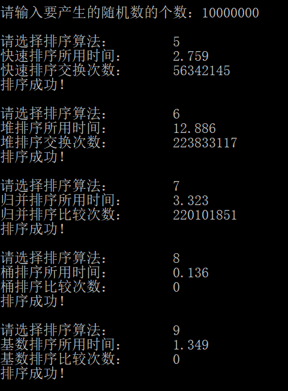

# 数据结构课程设计

#### 作者：张文喆

## 8 种排序算法的比较案例

### 0. 项目简介
随机函数产生10000个随机数，用快速排序，直接插入排序，冒泡排序，选择排序的排序方法排序，并统计每种排序所花费的排序时间和交换次数。其中，随机数的个数由用户定义，系统产生随机数。并且显示他们的比较次数。 

### 1. 项目运行效果

- 输入随机数个数，并选择排序类型  
在程序运行之初，用户首先会被要求输入随机数的个数。输入完毕后，会被要求选择排序的类型。  

经过实践发现，项目示例中的比较次数可能存在错误，但这并不影响我们比较各种排序算法的时间复杂度；而各种排序方案，除了桶排序和基数排序外，在空间上的差距并不大，所以我在后面会着重分析各种排序算法的时间复杂度。为此我将采用不同的随机数数量进行测试。

### 2. 时间测试  
在本项测试中，将不同的随机数数量设置为不同的等级，规定某一排序算法消耗时间超过1s，即告“淘汰”，无法进入下一等级的测试。

- 20000个随机数  
  
冒泡排序、直接插入排序被淘汰

- 50000个随机数  
  
选择排序被淘汰

- 100000个随机数  

- 1000000个随机数  
  
希尔排序被淘汰

- 10000000个随机数  
  
快速排序、堆排序、归并排序、基数排序被淘汰