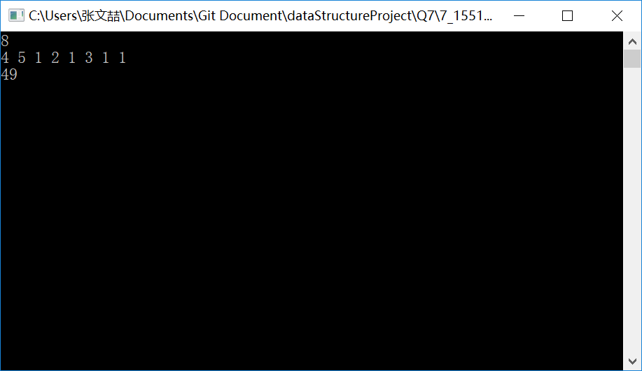

# 数据结构课程设计

#### 作者：张文喆

## 修理牧场

### 0. 项目简介  
农夫要修理牧场的一段栅栏，他测量了栅栏，发现需要N块木头，每块木头长度为整数Li个长度单位，于是他购买了一个很长的，能锯成N块的木头，即该木头的长度是Li的总和。但是农夫自己没有锯子，请人锯木的酬金跟这段木头的长度成正比。为简单起见，不妨就设酬金等于所锯木头的长度。例如，要将长度为20的木头锯成长度为8，7和5的三段，第一次锯木头将木头锯成12和8，花费20；第二次锯木头将长度为12的木头锯成7和5花费12，总花费32元。如果第一次将木头锯成15和5，则第二次将木头锯成7和8，那么总的花费是35（大于32）.

### 1. 项目运行效果
- 输入目标木头数量N  
在程序运行之初，用户会被要求输入木头数量N，用以接受接下来每段木头的长度。  
```c++
int size;
cin >> size;
while (size < 1)
{
	cerr << "请输入大于0的数字N！" << endl;
	cin.clear();
	cin.ignore();
	cin >> size;
}

int count = size, length;
auto queue = new int[size + 1];
```
在用户输入N后，程序会根据N的值建立一个大小为N+1的int数组，用于存储每段木头的长度。  

- 逐个输入木头长度Li  
输入的木头长度被储存在之前的数组中，然后被转化为最小二叉堆。  
```c++
Heap::Heap(int* queue, const int size)
	:queue(queue), size(size), totalMoney(0)
{
    for (int i = size / 2;i > 0;--i)
        percolateDown(i);
}
```
我将在之后解释为何将数组转化为最小二叉堆。

- 运行截屏  

  

### 2. 概述

- 项目要求  
  1. 输入格式：输入第一行给出正整数N（N<10^4），表示要将木头锯成N块。第二行给出N个正整数，表示每块木头的长度。  
  2. 输出格式：输出一个整数，即将木头锯成N块的最小花费。

- 实现方法  
此题极易，构造一棵哈夫曼树即可。沿着这课哈夫曼树，自根向下按广度优先遍历的树叶即是每段木头的截取时机；每个叶子的值为木头的长度，每一个非叶子节点的值都等于左右儿子值之和，于是根节点的值就是最小开销。  
那么问题转化为构建哈夫曼树，这也是我选择建立最小二叉堆的缘故。构造哈夫曼树时需要不断选取当前开销中的最小值，并将新的开销值插入队列或者其他结构。为了实现这两个目的，我们可以简单地选择普通的数组，并且每次遍历数组从中选取最小值，并将新产生的值放入恰当的位置，比如被删去的开销值的位置。  
但是显而易见的，这种方法过于简单抵低效，稍加分析不难发现，这样做的查找总开销为O(n^2)，插入总开销为O(n)，并且需要一些标识来指明这个位置上的开销值是否已被删除，这需要一个额外的空间开销O(n)。如果我们选用二叉堆，那么查找的总时间降至O(nlogn)，插入开销也为O(nlogn)，并且这不需要额外的空间存放标记；当然将普通的数组转化为堆，还需要一个耗时为O(n)的操作，不过这无伤大雅。所以我们认为堆是好的。

### 3. 类及类成员介绍  

- #### Heap类

  - ##### 成员变量  
  |成员名称|属性|类型|描述|
  |-------|----|----|---|
  |queue|private|int*|指向优先队列的指针|
  |size|private|int|队列中元素的个数|
  |totalMoney|private|int|记录总开销|

  - ##### 成员函数  
  |函数名称|返回值类型|描述|
  |-------|----------|---|
  |Heap|无|构造函数|
  |percolateDown|void|实现下滤算法|
  |percolateUp|void|实现上滤算法|
  |popMin|int|从堆中弹出最小的元素(即根节点)|
  |insert|void|将元素插入二叉堆|
  |findBestSolu|void|构造哈夫曼树|
  |showHeap|void|打印优先队列|

