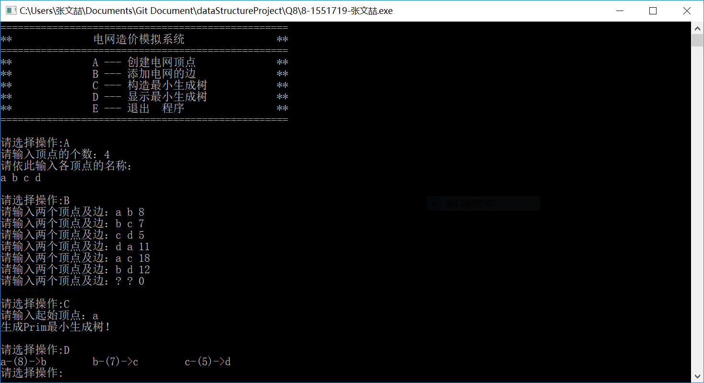

# 数据结构课程设计

#### 作者：张文喆

## 电网建设造价模拟系统

### 0. 项目简介
假设一个城市有n个小区，要实现n个小区之间的电网都能够相互接通，构造这个城市n个小区之间的电网，使总工程造价最低。请设计一个能够满足要求的造价方案。

### 1. 项目运行效果
- 输入顶点数目和名称  
在程序开始运行后，用户应当首先选择A项，输入顶点数量和名称。如果用户试图跳过这一步，那么他们会收到一条错误提示。  
```c++
cout << "请输入顶点的个数：";
int num;
cin >> num;
while (cin.fail() || num < 1)
{
	cerr << "请输入大于0小INT_MAX的顶点个数！" << endl;
	cin.clear();
	cin.ignore();//防止缓冲区溢出
	cin >> num;
}

if (graph != NULL)
	delete graph;
graph = new Graph(num);
...
enterNode(num, graph);
```

- 添加电网的边  
没有添加边的顶点，一概被视为孤立点。在由孤立点的前提下是无法建立最小生成树的。所以用户应当保证自己输入了足够的边，使得整个图是连通的。  
除此之外，由于此处要输入的内容较多，所以在这里添加了许多用于容错的代码，并且合理运用了goto语句，使用户能够重新输入。  

- 构造最小生成树  
在构造最小生成树时，要求：  
  1. 图必须是连通的  
  2. 指定的顶点必须存在于图中  

  若以上两点有任一点不符合要求，用户都将收到一条错误提示。

-  运行截图  
  

### 2. 概述

- 项目要求  
在每个小区之间都可以设置一条电网线路，都要付出相应的经济代价。n个小区之间最多可以有n（n-1/2条线路，选择其中的n-1条使总的耗费最少。  

- 实现方法  
这是图论中最典型的构建最小生成树的问题，解决方法由Prim算法和Kruskal算法。由于此题要求能够制定起始顶点，故采用Prim算法。

### 3. 类及类成员介绍

- #### Node类

  - ##### 成员变量  
  |成员名称|属性|类型|描述|
  |-------|----|----|---|
  |insideName|public|int|记录顶点的内部编号|
  |money|public|int|记录从某一顶点到自身的开销|
  |next|public|Node*|邻接表中指向下个顶点的指针|

  - ##### 成员函数
    仅有构造函数

- #### Feature类

  - ##### 成员变量  
  |成员名称|属性|类型|描述|
  |-------|----|----|---|
  |known|public|bool|记录顶点是否已被加入生成树中|
  |weight|public|int|记录从上个顶点到达自身的开销|
  |whoChangeMe|public|int|记录树中与其连接的上个节点的编号|

  - ##### 成员函数  
  |函数名称|返回值类型|描述|
  |-------|----------|---|
  |Feature|无|构造函数|
  |update|bool|修改变量值|

- #### Graph类  

  - ##### 成员变量  
  |成员名称|属性|类型|描述|
  |-------|----|----|---|
  |numOfNode|private|int|记录图中顶点的数量|
  |nameList|private|string*|记录节点的名称|
  |adjaList|private|Node**|储存图的邻接表|
  |featureList|private|Feature*|储存节点的特征值|

  说明：特征值指Feature类中节点的权值、内部编号以及上个节点编号等信息

  - ##### 成员函数
  |函数名称|返回值类型|描述|
  |-------|----------|---|
  |Graph|无|构造函数|
  |~Graph|无|析构函数|
  |storeName|bool|储存顶点的名字|
  |findName|int|将顶点的名字转换为内部编号|
  |storeAdja|bool|邻接给定的两个顶点，并储存在邻接表中|
  |initPrim|bool|初始化最小生成树，并检查有无孤立点|
  |getMinFromFeatureList|int|查找featureList中权值最小且不在生成树上的点|
  |buildPrimTree|bool|建立最小生成树|
  |printPrimTree|void|打印最小生成树|