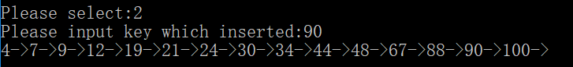
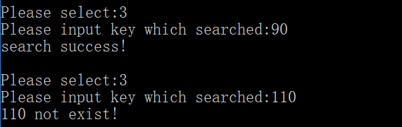
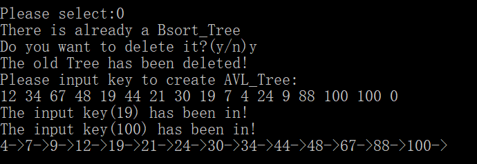
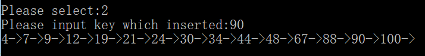
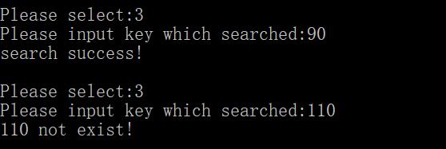
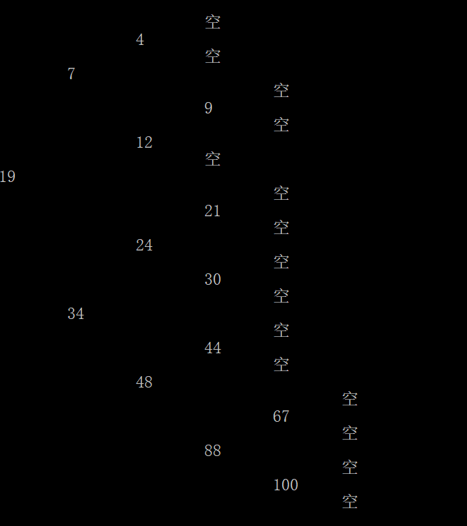
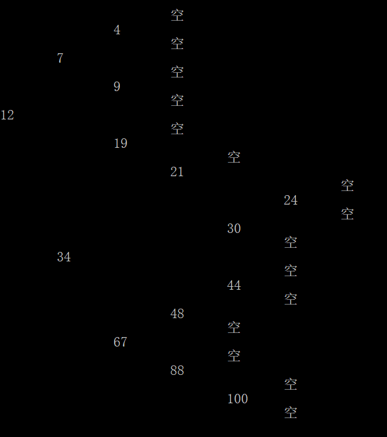
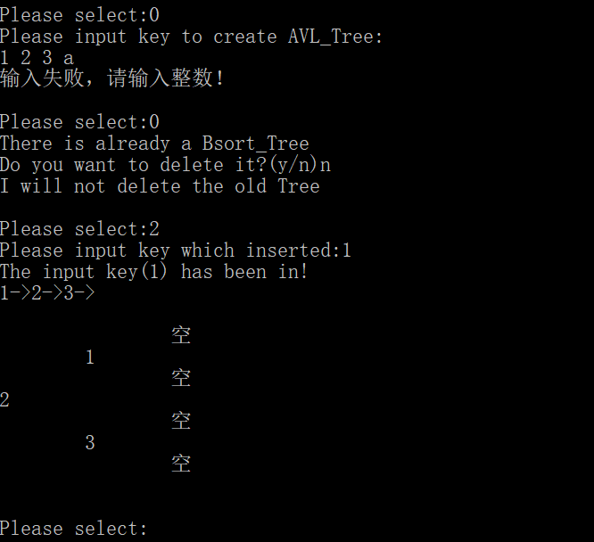
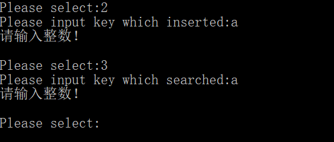

# 数据结构课程设计

#### 作者：张文喆

## 二叉排序树

### 0. 项目简介
依次输入关键字并建立二叉排序树，实现二叉排序数的插入和查找功能。

### 1. 项目运行效果
- 构建二叉排序树  
用户按照顺序输入数字，0是输入结束的标识符，不会出现在二叉排序树中。根据二叉排序树的要求，我规定：比当前节点小的数字，插入当前节点的左子树中，否则插入右子树中，直到当前节点为NULL，则将要插入的数值放置在此处。  
```c++
if (!checkIfThereIsATree(tree))
{
	tree = new OrderTree();
	if (tree == NULL)
	{
		cerr << "内存空间不足!" << endl;
    	exit(1);
	}
	buildTree(tree);
	isAVL = false;
}
```  

在真正建立二叉排序树之前，先检查是否已经存在一棵二叉排序树了。如果确实存在，就询问用户是否将原有的树删除。这一点我将在核心代码解释中详解。

  

- 插入数字  
用户一次只能输入一个要插入的数字。二叉排序树会先检查这个数字是否已经存在于树中，如果是，则会返回错误提示；如果不是，才会真正执行插入动作。  



- 查询数字  
用户输入数字进行查询。由于二叉排序树具有良好的结构性，所以查询速度非常快。但是普通的二叉排序树无法保持较好的平衡性，在极端情况下会退化为链表，所以我在后面对其进行了改造，这点之后再讲。  



### 2. 概述

- 项目要求  
二叉排序树就是指将原来已有的数据根据大小构成一棵二叉树，二叉树中的所有结点数据满足一定的大小关系，所有的左子树中的结点均比根结点小，所有的右子树的结点均比根结点大。  
二叉排序树查找是指按照二叉排序树中结点的关系进行查找，查找关键自首先同根结点进行比较，如果相等则查找成功；如果比根节点小，则在左子树中查找；如果比根结点大，则在右子树中进行查找。这种查找方法可以快速缩小查找范围，大大减少查找关键的比较次数，从而提高查找的效率。  

- 实现方法  
构建最基础的二叉排序树即可。但是由于之前叙述的原因，我在提供普通二叉排序树功能的同时，还加入了AVL树。AVL树是一种最基本的平衡树，在任何时刻，AVL树中任一节点的左右子树高度相差不超过1.为了保持这个性质，我们必须在普通的二叉查找树上增添新的功能：单旋转和双旋转；同时节点中也有增加高度信息。  

    - 建立AVL树  
    

    - 插入数字  
    

    - 查询数字  
    

    为了更好地比较两种二叉排序树的排序效果，我按照二叉排序树的节点层次打印出了两棵树，对比图如下。  
    AVL树：  
      
    普通二叉排序树：  
      
    可以看到，在平衡性上AVL树是由于普通二叉排序树的，这就决定了在搜索时，AVL树的效率要高于普通二叉排序树。在最坏的情况下，前者的时间复杂度为O(logn)，而后者为O(n)。但前者要求在插入时执行额外的旋转操作，这是为了维持AVL树的平衡性而不可避免地开销。  

### 3. 类及类成员介绍

- #### Node类  

    - ##### 成员变量  
    |成员名称|属性|类型|描述|
    |--------|---|----|---|
    |num|public|int|记录节点的值|
    |left|public|Node*|指向左子树的指针|
    |right|public|Node*|指向右子树的指针|
    |height|public|int|记录节点的高度信息|

    - ###### 成员函数  
    仅有构造函数

- #### OrderTree类

    - ##### 成员变量  
    |成员名称|属性|类型|描述|
    |-------|----|----|---|
    |isEmpty|public|bool|描述二叉树是否为空|
    |root|private|Node*|记录二叉树的根节点|

    - ##### 成员函数  
    |函数名称|返回值类型|描述|
    |-------|---------|----|
    |OrderTree|无|构造函数|
    |~OrderTree|无|析构函数|
    |getRoot|Node*|返回根节点|
    |renewRoot|void|更新根节点|
    |releaseNode|void|删除某一节点|
    |insert|bool|向普通二叉排序树插入新节点|
    |insert*|Node*|向AVL树插入新节点|
    |getHeight|int|获取节点高度|
    |max|int|返回两个参数中较大的一个|
    |singleRotateWithLeft|Node*|左子树单旋转|
    |singleRotateWithRight|Node*|右子树单旋转|
    |doubleRotateWithLeft|Node*|左子树双旋转|
    |doubleRotateWithRight|Node*|右子树双旋转|
    |search|bool|搜索某一节点是否存在于树中|
    |showAll|void|以箭头格式打印二叉树|
    |showAll*|void|按结构打印二叉树|  
    \* ：注意函数重载

### 4. 核心代码解释

- 向普通二叉排序树插入  
```c++
bool OrderTree::insert(const int num)
{
	Node* newNode = new Node(num);
	...

	Node* temp = root;
	while (temp != NULL)//事实上只在第一次判断时有效
	{
		if (num < temp->num)//插入的数字小于节点的值，插入其左子树中
		{
			if (temp->left != NULL)//继续与左儿子比较
				temp = temp->left;
			else//此节点无左儿子，则将插入的节点作为左儿子
			{
				temp->left = newNode;
				return true;
			}
		}
		else if (num > temp->num)//插入右子树
		{
			if (temp->right != NULL)//继续与右儿子比较
				temp = temp->right;
			else//此节点无右儿子，则将插入的节点作为右儿子
			{
				temp->right = newNode;
				return true;
			}
		}
		else//num已存在于二叉树中
		{
			cerr << "The input key(" << num << ") has been in!" << endl;
			return false;
		}
	}

	root = newNode;//到达此处则说明root为NULL
	isEmpty = false;//二叉排序树不再为空
	return true;
}
```
对于普通的二叉排序树的插入工作十分简单：递归进行，每层递归判断三大点： 
1. 当前节点的值大于插入的节点的值，要将新节点插入当前节点的左子树
2. 当前节点的值小于插入的节点的值，要将新节点插入当前节点的右子树
3. 当前节点的值等于插入的节点的值，输出错误信息，不执行插入动作  

对于其中的1，2两点，还要进一步判断，当前节点的左/右子树是否为空，若为空，直接将新节点插在左/右子树的位置上；否则继续递归地执行插入操作。

- 向AVL树插入  
```c++
Node* OrderTree::insert(const int num, Node* tree)
{
	if (tree == NULL)//将新节点插在空位置上
	{
		tree = new Node(num);
		...
	}
	else if(num < tree->num)//插在左子树中
	{
		tree->left = insert(num, tree->left);
		if (getHeight(tree->left) - getHeight(tree->right) == 2)//破坏了AVL特性
		{
			/*新节点插入到了左儿子的左子树中，要求进行左子树单旋转*/
			if (num < tree->left->num)
				tree = singleRotateWithLeft(tree);
			/*新节点插入到了左儿子的右子树中，要求进行左子树双旋转*/
			else
				tree = doubleRotateWithLeft(tree);
		}
	}
	else if (num > tree->num)//插在右子树中
	{
		tree->right = insert(num, tree->right);
		if (getHeight(tree->right) - getHeight(tree->left) == 2)//破坏了AVL特性
		{
			/*新节点插入到了右儿子的右子树中，要求进行右子树单旋转*/
			if (num > tree->right->num)
				tree = singleRotateWithRight(tree);
			/*新节点插入到了右儿子的左子树中，要求进行右子树双旋转*/
			else
				tree = doubleRotateWithRight(tree);
		}
	}
	else//num已存在于AVL树中
	{
		cerr << "The input key(" << num << ") has been in!" << endl;
		return tree;
	}

	tree->height = max(getHeight(tree->left), getHeight(tree->right)) + 1;//更新根的高度
	isEmpty = false;//二叉排序树不再为空
	return tree;
}
```
对于AVL树的插入，在逻辑上与插入普通二叉排序树完全一致，只是在每次插入之后，都要检查是否破坏了AVL树的平衡性。例如，当插入到当前节点的左子树时，我们只需检查`左子树的高度`-`右子树的高度`是否小于等于1，如果不是，就说明AVL的平衡性被破坏了。而且，由于当我们插入左子树时，只有可能`左子树的高度`-`右子树的高度`大于1，绝无可能反过来。请记住，我们在执行对AVL树的插入之前，AVL树是平衡的。

- 左/右单旋转  
由于左右单旋转的原理是一样的，所以我们这里只展示左单旋转的代码，解释也是在此基础上进行的。
```c++
Node* OrderTree::singleRotateWithLeft(Node* tree)
{
	Node* newTree = tree->left;
	tree->left = newTree->right;
	newTree->right = tree;

	tree->height = max(getHeight(tree->left), getHeight(tree->right)) + 1;
	newTree->height = max(getHeight(newTree->left), getHeight(newTree->right)) + 1;

	return newTree;
}
```
如果某个节点的左右子树破坏了AVL树的平衡性，假设是左子树高于右子树，那么我们将该节点作为根节点，执行左单旋转。  
左单旋转的过程非常简单，从结果上来看，它完成了以下工作：  
1. 将根节点的左子树作为新的根节点
2. 原根节点的左子树变为新根节点的原右子树
3. 新根节点的右子树变为原根节点
4. 更新新旧根节点的高度信息

- 左/右双旋转  
由于左右双旋转的原理是一样的，所以我们这里只展示左双旋转的代码，解释也是在此基础上进行的。  
```c++
Node* OrderTree::doubleRotateWithLeft(Node* tree)
{
	tree->left = singleRotateWithRight(tree->left);
	return singleRotateWithLeft(tree);
}
```
单从结果上进行解释，双旋转无疑比单旋转复杂了许多，但是在单旋转的基础上实现起来非常容易：只需要对根节点的左儿子执行一次右单旋转，再对根节点执行一次左单旋转即可。双旋转的最终结果描述起来较为苦难，但我们可以从代码上清晰地了解到：左双旋转的第一步，是将根节点的左子树执行一次右单旋转，这把问题转变为了一个单旋转问题；第二步，对根节点执行左单旋转。经过这两个步骤，左双旋转就完成了。  
值得注意的一点是，不论是单旋转还是双旋转，我们在函数执行完毕时，都要将新的根节点作为返回值返回，这是为了原根节点的父节点能够及时地更新儿子的情况。

- 查询数字  
```c++
bool OrderTree::searh(const int num)
{
	Node* temp = root;
	while (temp != NULL)
	{
		if (num < temp->num)//查询元素小于节点的值，继续查询其左子树
			temp = temp->left;
		else if (num > temp->num)//继续查询右子树
			temp = temp->right;
		else//找到了
		{
			cout << "search success!" << endl;
			return false;
		}
	}

	cout << num << " not exist!" << endl;//到达此处，说明未找到元素
	return false;
}
```
查询操作极为简单，只要按照构建二叉排序树的规则查找即可，并且不用区分普通二叉排序树和AVL树，因为两者都具有`二叉排序树`的属性。

- 打印二叉排序树  
```c++
void OrderTree::showAll(Node* node)
{
	if (node == NULL)
		return;

	showAll(node->left);
	cout << node->num << "->";
	showAll(node->right);
}

void OrderTree::showAll(Node* node, const int depth)
{
	if (node == NULL)
	{
		for (int i = depth;i > 0;--i)
			cout << '\t';
		cout << "空" << endl;
		return;
	}

	showAll(node->left, depth + 1);
	for (int i = depth;i > 0;--i)
		cout << '\t';
	cout << node->num << endl;
	showAll(node->right, depth + 1);
}
```
两种打印方式都采用了中序遍历，只是按照树的结构进行打印的showAll函数额外传递了一个深度函数，用于控制格式。

### 5. 容错测试

- 构建二叉查找树时非法输入  
  
注意到，在构建二叉查找树时，如果出现了非法的输入，之前的输入不会被丢弃，生成的二叉查找树也不会被删除。从这个角度上讲，非法输入起到了结束输入的作用。  
另外，在已经存在一棵二叉查找树的前提下，用户可以在创建二叉查找树时自行决定是否删除旧的二叉查找树。在上图中，我没有选择删除，那么程序就不会要求输入数据、构建新的二叉查找树。

- 插入和查找时非法输入  
  
```c++
int num;
cin >> num;
if (cin.fail())
{
	cerr << "请输入整数！" << endl;
	cin.clear();
	cin.ignore();
	return;
}
```
容错逻辑全部由以上代码完成。